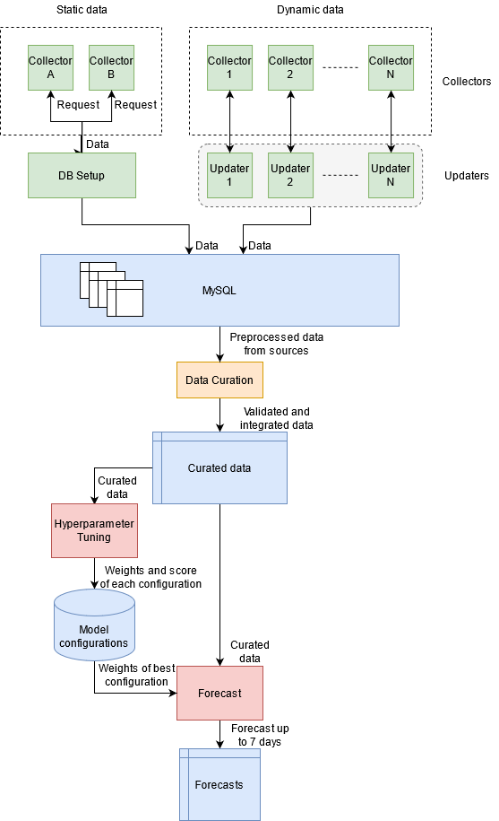

# COVID-19 Learning

## Introduction

This project consists in the realisation of a system that collects COVID-19 related data for the Italian
Province of Trento from multiple sources and integrates them into a single database. Those data are then passed on to a
machine learning pipeline that implements, trains and validates a predictive model that provides short-term forecasts
(up to 7 days) of COVID-related metrics.

## System overview

The high-level picture of the system infrastructure is depicted in the figure below.



The components can be divided into four groups, according to their task:
- data collection from external sources (green): collectors, updaters and the DB Setup pipeline.
- data transformation and integration (orange).
- machine learning (red): Hyperparameter Tuning and Forecast.
- persistence (blue): MySQL storage layer for preprocessed data and MongoDB storage layer for curated data, 
  model configurations and forecasts. 

A description of the components is provided below.

**Collectors**. Each collector is a component that, provided some search criteria such as the date range, collects data from a specific
source and returns a preprocessed version of them. There is therefore one collector for each source. Some of them are
labelled as "static" because they collect data that are not supposed to change on a daily basis, such as geographical
or population data. "Dynamic" collectors, on the other hand, deal with data that are typically updated each day.

**MySQL storage layer**. This MySQL database stores preprocessed data from the various sources into separate tables, i.e. data from each source
are stored as separate entities in the relational database.

**DB Setup**. This pipeline collects, preprocesses and saves in the storage layer some data that are supposed to be collected
only once rather than daily. It calls the "static" data collectors and passes the data on to the MySQL storage layer.

**Data updaters**. Each of these pipelines orchestrates the collection of data from a specific source, thus for a specific entity in the 
database. Each of them checks the date of the most recent record for the corresponding entity, then calls the collector
passing the appropriate date range for the search. The resulting records are inserted into the relational database.
Updaters are independent from each other, thus they can be launched either serially or in parallel.

**Data curation**. This pipeline extracts data from each of the tables in the relational database and joins them into a single table,
also performing some transformations and some additional calculations in order to enhance the data. The resulting,
curated data contains the variables that are ready to be used in the analysis. This data table is stored in the MongoDB
storage layer.

**Hyperparameter tuning**. This ML pipeline extracts curated data and performs cross validation to choose the best configuration of hyperparameters
of the predictive model. For each of the tested configuration, the choice of parameters and the resulting model score
(according to a performance measure) are stored in the MongoDB storage layer.

**Forecast**. This ML pipeline extracts the best model configuration from MongoDB, fits the model and produces forecasts that are stored into 
MongoDB.


For additional information about each component, see the documentation for the package in which they are implemented, 
according to the following description of the repository structure.


## Repository structure

### Packages

- `data`: contains model classes for each of the stored entities, the corresponding data access object
  (DAO) classes and some higher-level libraries for the interaction with the databases --> its README.md file describes
the **data schema**.
- `configuration`: retrieves the necessary environment variables.
- `collectors`: contains all data collectors.
- `updaters`: contains the updaters.
- `ml`: machine-learning-related functions and classes.
- `pipelines`: contains the main pipelines, that can be run either as scripts or imported by other scripts.
- `launchers`: contains scripts that run the pipelines in a pre-defined way.

See each package's documentation for further information and code snippets.
 
### Installation files

- `requirements*`: list of required platform-dependent libraries (see installation information below).
- `geopandas_windows_wheels`: installation files for GeoPandas and its dependencies, required on Windows.

### Resources and logs

- `resources`: contains local copies of some data that are used by collectors.
- `logs`: contains text files written by some of the pipelines.

----

## Setup

### Environment and dependencies

This application requires **Python 3.8**.

Create virtual environment:

```shell
# Linux
python -m venv ./venv

# Windows
python -m venv .\venv
```

Activate environment:

```shell
# Linux
source ./venv/bin/activate

# Windows
.\venv\Scripts\activate
```

Install dependencies (Linux):

```shell
python -m pip install --upgrade pip
pip install -r requirements.txt
```

On Windows, use `requirements_windows.txt` instead of `requirements.txt`.


### Environment variables

The following environment variables must be set: MySQL credentials (`MYSQL_HOST`, `MYSQL_USER`, `MYSQL_PW`, `MYSQL_SCHEMA`),
MongoDB credentials (`MONGODB_USER`, `MONGODB_PW`, `MONGODB_CLUSTER`, `MONGODB_DEFAULT_DB`), Google API key
(`GOOGLE_API_KEY`) and the GitHub API key (`GITHUB_TOKEN`).

When running locally, the above variables can be defined in a .env file. If the .env file is not provided, set each 
environment variable manually.


## How to run

**Attention**: storage layer must be set up and configured with the corresponding credentials (see above).

The pipelines must be run in the following order:
1. DB setup
2. Updaters (serially, through the pipeline `pipelines/data_update.py`) or in parallel with a custom launcher
3. Data curation
4. Hyperparameter tuning (one run for each model, as defined in a configuration file in `pipelines/hyperparameter_tuning_configurations`)
5. Forecast

### Default pipeline launchers

Run each of the following pipeline with `python <pipeline>`:

1. `pipelines/db_setup.py`
2. `launchers/data_update_launcher.py`
3. `pipelines/data_curation.py` (alternatively, steps 2. and 3. can be run serially by calling `launchers/update_and_curation_launcher.py`)
4. `launchers/hyperparameter_tuning_launcher.py`
5. `launchers/forecast_launcher.py`

### Dockerized application

The image of this application can be retrieved from GitLab Container Registry with the following command:

```bash
docker pull registry.gitlab.com/alessio.rimessi/covid19learning
```

The main pipelines launchers can be run with the following commands:
```bash
docker run registry.gitlab.com/alessio.rimessi/covid19learning db_setup
docker run registry.gitlab.com/alessio.rimessi/covid19learning data_update
docker run registry.gitlab.com/alessio.rimessi/covid19learning data_curation
docker run registry.gitlab.com/alessio.rimessi/covid19learning hyperparameter_tuning
docker run registry.gitlab.com/alessio.rimessi/covid19learning forecast 
```

### Suggested operation:

- Run DB setup only once.
- Schedule `update_and_curation_launcher.py` to run once a day at midnight (when all sources should have records for the
  current day available; if not, some records will be missing and they will be collected the day after).
- Perform hyperparameter tuning once; if not satisfied by the model, the pipeline can be run again.
- Schedule Forecast to run once a day right after the data collection and validation pipelines, or run on demand.

Forecasts will be saved in MongoDB in the "forecasts" collection. Results can be retrieved with the corresponding DAO.

In this example, forecasts for variable "new_cases" are retrieved:

```python
from data.dao import ForecastMongoDao
dao = ForecastMongoDao()
results = dao.get_by_date("new_cases")  # can also pass data range: date_from, date_to
```

`results` is a list of instances of the class `Forecast` defined in `data/models.py`. It can be transformed into a pandas
DataFrame:

```python
from data.models import Forecast
df = Forecast.to_df(results)
```

----
### Credits

Project icon from scitechdaily.com
