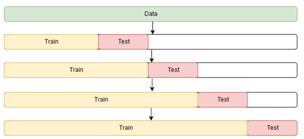

# Machine learning package

This package contains functions and classes used to perform regression, cross-validation, measuring model performance,
hyperparameter tuning and visualisation.

Package structure:

- `cross_validation.py`: contains a function that evaluates a model on multiple training-validation sets and computes
  the average performance score.
- `model_selection.py`: functions for the computation of the performance score of a model and the exhaustive search in
  the hyperparamater space based on the optimisation of the performance score.
- `performance_measures.py`: defines how to score a model's performance based on predictions and actual data.
- `sarimax`: implementation of the class `Sarimax`, which wraps statsmodels' SARIMAX class.
- `train_test_splitting`: functions and classes for splitting a dataset into training and test.
- `viz`: implements a function for plotting the (out-of-sample) forecasts of a time-series model with actual data,
  in-sample predictions and the forecasted confidence intervals; it also allows to plot the residuals of in-sample
  predictions.

## Sarimax

This class is a wrapper
for [statsmodels' SARIMAX](https://www.statsmodels.org/dev/generated/statsmodels.tsa.statespace.sarimax.SARIMAX.html),
to which it adds functionalities.

SARIMAX a general time-series model. The name is shorthand for seasonal autoregressive integrated moving average with
exogenous regressors. It depends on the following parameters:

- p: number of lags of the autoregressive part (AR).
- q: number of lags of the moving average part (MA).
- d: order of differentiation or integration (I).
- P: number of lags of the seasonal autoregressive part.
- Q: number of lags of the seasonal moving average part.
- D: order of differentiation for the seasonal component.
- m: periodicity (number of periods in a season).
- t: controls the deterministic trend polinomial, which could be none, constant, linear with time or it could include a
  combination of terms, also of higher order.

Exogenous regressors are quantities that are hypothesised to be in a linear relation with the output (endogenous)
variable. Whilst linear regression assumes independent and identically distributed residuals and it is therefore not
suited for time series, SARIMAX assumes regression residuals can be modelled by a SARIMA process. If exogenous variables
are not provided, SARIMAX simplifies to a univariate SARIMA model.

`Sarima` accepts the endogenous variable `endog` and the exogenous variable `exog` as pandas DataFrames or,
alternatively, a single DataFrame `data` which has the endogenous variable as the first column and exogenous variables
as the other columns.

```python
from ml import Sarimax

# endog and exog DataFrames
model = Sarimax(endog=y, exog=x, config=cfg)

# a single DataFrame
model = Sarimax(data=df, config=cfg)
```

`cfg` is a dictionary in the form

```python
cfg = {"arima_order": (p, d, q),
       "seasonal_order": (P, D, Q, m),
       "trend": str}
```

If `seasonal_order` key is omitted, the model will have no seasonal component. Trend could one of 'n' (none), 'c' (
constant), 't' linear or 'ct' (constant + linear terms). If the key is omitted, the model will have no trend component.

Other keyword arguments for Sarima are:

- `endog_column`: specify the name of the column of `data` that contains the endogenous variable, if it is not the first
  column.
- `relax_constraints`: if true (default), set `enforce_stationarity` and `enforce_invertibility` parameters of
  statsmodels' SARIMAX to false.
- `convergence_warnings`: default True, it shows the warnings produced during the model fitting optimisation process.
- `transformation`: transform data prior to fitting the model (the currently available method is "sqrt" which computes
  the square root of the endogenous variable); fitted values and forecasts will be transformed back.

### Train the model

Once Sarima is instantiated, it cannot be used neither to produce in-sample predictions nor out-of-sample forecasts. It
must first be trained by:

```python
model.fit()
```

which changes the status of the model to trained (according to the instance variable `trained`) and stores some training
performance measures such as the Akaike Information Criterion (`aic`) as instance variables.

### Compute test performance with cross validation

The method `cross_validate` performs cross validation and computes the test score. See the section about cross
validation below.

```python
model.cross_validate(splits=splits, performance_measure=func)
```

`splits` is a list of two lists of indices, which allow to build the training and test set from the input dataframes
respectively. The list has a single pair of lists if cross validation is performed with a single training and validation
set; it has more pairs of lists in the case of k-fold cross validation, in which training and test sets are different
for each fold.

`performance_measure` is a function defined in `performance_measures.py`. Default is `rmse`.

## Performance score

Performance scoring function can be defined to map (actual, predicted) to a real number. `actual` and `predicted` are
arrays or pandas DataFrames.

The currently available measure is RMSE (Root Mean Square Error), defined as the square root of the average squared
difference between actual and predicted values.

## Train-test splitting

When performing training and testing, the dataset must be divided into two subsets. To do so, it is sufficient to
identify the two sets of indices (of the full dataset) that identify the members of each subset.

When performing k-fold cross validation, the full dataset is divided into k subsets. At each cross validation iteration,
one of the sets is used as a test set while all others are used as training set. The splitting can be performed by
creating a list with k elements, one for each cross validation iteration. The elements in the list are a pair of lists,
each containing the indices that identify the training and test set respectively.

With time series, predictions on unseen data must be performed using a test set of future data. By splitting the full
dataset into _n_ chunks, cross validation will use the chunks to build up training and test set at each iteration in the
following way:

- train on 1, test on 2
- train on 1+2, test on 3
- train on 1+2+3, test on 4

The dataset subdivision can be depicted like this:



Image source: [medium.com](https://medium.com/@soumyachess1496/cross-validation-in-time-series-566ae4981ce4)

The class `TsCvSplitter` is responsible for the creation of the indices that create the subsets at each cross validation
iteration. As in k-fold cross validation, the full dataset is divided according to a pair of lists of indices for
training and test set respectively, and these pairs are packed in a list.

Usage:

```python
from ml.train_test_splitting import TsCvSplitter

splitter = TsCvSplitter(n_splits=n, max_test_size=m)
splits = splitter.split(data)
```

The argument `max_test_size` can be used to limit the size of the test set at each iteration to a number _m_ of
elements.

## Cross-validation

Once the splits have been defined as above, cross validation consists in the iteration over all splits of the following
steps:

- fitting a model to the training data.
- computing the m-steps-ahead forecast (where _m_ is the test set size, which could be limited as seen above).
- combining the forecasts with the observations in the test set to compute the performance measure.

Each iteration produces a performance measure. Its mean and standard error can be used to assess the average test
performance.

This action is performed with the `model_cross_validation` function in the module `cross_validation.py`.

For example, the following code performs cross validation of a `Sarimax` model by using 5 splits of the full dataset:

```python
from ml.train_test_splitting import TsCvSplitter
from ml.cross_validation import model_cross_validation

splitter = TsCvSplitter(n_splits=5)
splits = splitter.split(data)

performance_mean, performance_se = model_cross_validation(data=data, splits=splits, model=Sarimax, config=cfg, **kwargs)
```

The function returns mean and standard error (standard deviation divided by the square root of the number of cross
validation iterations) according to a performance measure, which is `ml.performance_measures.rmse` by default, but any
different implementation can be passed through the keyword argument `performance_measure`.

When working with transformed inputs, the string identifying the transformation can be passed through the keyword
argument `transformed` so that the performance measure is computed on untransformed quantities. The currently supported
transformation is "sqrt".

Additional keyword arguments will be passed to the `model` constructor. When using `Sarimax`, it is necessary to provide
its configuration `config`, as in the above example.

In principle, the function works with any model implementation that has a `fit` and a `forecast` method, similarly to
Sarimax.

## Hyperparameter tuning

Hyperparameter tuning consists in finding the model configuration with which the model has the best performance. The
best approach is to evaluate the performance measure on unseen data, i.e. it must be a test performance measure.

Hyperparameter tuning can be described as follows:

- define the space of possible hyperparameters
- for each choice of hyperparameters, perform cross validation and assess model performance
- find the configuration that optimises the performance measure.

The function `ml.model_selection.get_sarima_configurations` takes the range for each parameter of the SARIMAX model and
yields a list of configurations as the set of all possibile combination of parameters. In a grid search or exhaustive
search, all combinations are tested in order to find the global optimum.

Example:

```python
from ml.model_selection import get_sarima_configurations

cfgs = get_sarima_configurations([0, 1, 2, 3], [0, 1], [0, 1, 2, 3], [0], [0], [0], [0], ['n'])
```

The function `ml.model_selection.grid_search` iterates over all the provided configurations and for each of them calls
the model scoring function.

Usage:

```python
from ml.model_selection import grid_search

results = grid_search(data=data, model=Sarimax, configurations=cfgs, splits=splits, parallel=False, **kwargs)
```

`splits` are computed as seen below. `transformation` keyword argument can be used to transform inputs and additional
keyword arguments will be passed to the model constructor. `performance_measure` can again be passed if different
than `rmse`.

If `parallel` is set to True, multiprocessing will be performed to speed up the execution. The maximum number of
parallel jobs can be set with the keyword argument `n_jobs`, which defaults to the number of available CPUs.

`results` is a list of dictionaries with the following keys:

- `cfg`: the parameter configuration.
- `score_mean`: the average score across cross validation iterations.
- `score_se`: the average score standard error.

Results are ordered by increasing or decreasing value of `score_mean`, depending on the performance measure. In the case
of RMSE, results are ordered in ascending order, so that the first element of the list corresponds to the best
performing model. The winning configuration can therefore be extracted in the following way:

```python
best_config = results[0]["cfg"]
```

which can be passed to `Sarimax` for forecasting, plotting and further statistical analysis.

For each configuration, the model is scored with the function `ml.model_selection.get_performance`, which instantiates
the model and calls its `cross_validate` method.

Usage:

## Model diagnostics, forecasts and visualisation

Once the model has been trained (by calling the `fit()` method), statistical analysis can be performed by using
statsmodels' SARIMAX methods `get_summary` and `plot_diagnostics`.

### Summary

```python
model.get_summary()
```

This method returns a pandas DataFrame which shows useful information such as:

- value, standard error and statistical tests on model coefficients
- Ljung-Box test for autocorrelations in the residuals
- Heteroskedasticity
- Jarque-Bera test for the normality of the residuals.

### Diagnostic plots

```python
model.plot_diagnostics()
```

This method produces a 2x2 plot grid with the following plots:

- standardised residuals over time
- histogram of standardised residuals with estimated density, along with a standard normal distribution for visual
  reference
- normal Q-Q plot
- autocorrelation between residuals.

### Forecast

To produce out-of-sample forecasts, the method `forecast` returns a pandas DataFrame with the forecast results for the
endogenous variable for the next `s` time steps in the future:

```python
forecasts = model.forecast(steps=s, exog=...)
```

`forecasts` is a DataFrame with the following columns:

- "forecast": forecasted values
- "se": standard error for the prediction
- "lower_ci" and "upper_ci": lower and upper bound of the confidence interaval (set to 95%).

When exogenous variables are present, their future values must be provided as a pandas DataFrame as the keyword
argument `exog`. For instance, they can be assumed to be constant and equal to the most recent known value. This
argument is not requested when there are no exogenous variables.

A more complex DataFrame can be returned with the method `get_prediction_and_forecast_df`. It is produced by combining
the `forecast` DataFrame described above, with one containing actual data ("data") and in-sample predictions ("fitted").
This object is useful for visualisations.

### Plot

```python
model.plot_prediction_and_forecast(steps=..., exog=...)
```

calls `forecast` and plots the actual data, in-sample predictions, forecasts and the forecasted 95% confidence
intervals.

If `plot_residuals` keyword arguments is set to True, fit residuals are plotted in a subplot below the main plot.

It is equivalent to calling the function `viz.plot_model`:

```python
from ml import viz

prediction_forecast_df = model.get_prediction_and_forecast_df(...)
viz.plot_model(prediction_forecast_df, residuals=model.fitted_model.resid, confint="95%")
```

Additional keyword arguments allow to customise the plot (`title` and `quantity`, i.e. the name of the endogenous
variable to be displayed on the y axis).

**Note**:

If a transformation is set when instantiating Sarima, forecasts and plots will have untransformed data.

